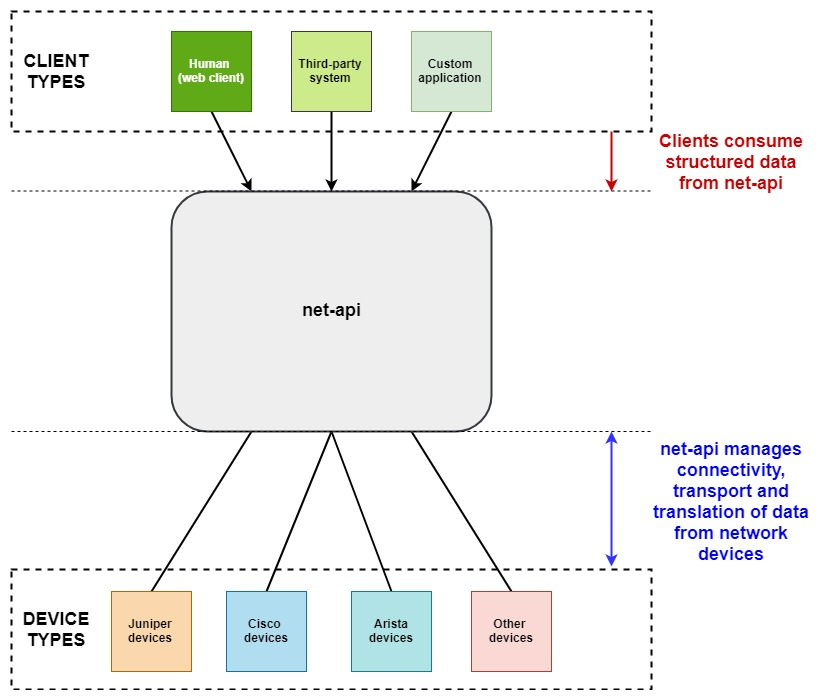

[](https://www.python.org/downloads/release/python-360/)
[](https://www.python.org/downloads/release/python-370/)
[](https://www.python.org/downloads/release/python-380/)
[](https://github.com/ambv/black)

# Introduction

net-api is a documented REST API platform which returns structured data from network devices. This application is a mix of technologies and techniques and has been developed to
highlight what is possible with multiple open source projects.

# Table of Contents

- [Overview](##net-api-overview)
  - [What's under the hood?](#whats-under-the-hood)
  - [Supported Environments](#supported-environments)
  - [More Examples](#more-examples)
- [Installation/Operating Instructions](#installationoperating-instructions)
  - [Python 3.x](#python-3x)
  - [Docker](#docker)
- [Example Use Cases](#example-use-cases)
- [Design Decisions](#design-decisions)
  - [Frontend Authentication](#frontend-authentication)
  - [Credential Management](#credential-management)
- [TODO/Roadmap](#todo/roadmap)
  - [TODO](#todo)
  - [Roadmap](#roadmap)
  
## net-api Overview

The overview of net-api is shown in the diagram below:



As shown in the diagram, net-api handles device authentication, data transformation and transport from network devices and presents the consumer of the application with a fully documented API. This approach has multiple benefits to name a few:

- Provide non-network operators access to **configuration and state about the network, without the ability to make direct changes to devices**.
- Provide a **reliable, structured API to query**, which can be leveraged from third-party systems or custom applications.
- Provide a **framework which is extensible and portable** to deploy in most environments. Additional operations or API calls can be developed with minimal effort.

## What's under the hood?

This application is made up of the following:

- [Flask](https://flask.palletsprojects.com/en/1.1.x/) web framework to serve the web application
- [Connexion](https://connexion.readthedocs.io/en/latest/) to handle HTTP requests and serve the SwaggerUI
- A fully documented API using [Swagger UI](https://swagger.io/tools/swagger-ui/)
- [Nornir](https://nornir.readthedocs.io/en/latest/) automation framework for device management
- [NAPALM](https://napalm.readthedocs.io/en/latest/) to present structured data back from multiple vendors for certain functions
- [TextFSM NTC Templates](https://github.com/networktocode/ntc-templates) support to parse CLI output into structured data
- [Genie](https://developer.cisco.com/docs/genie-docs/) support to parse CLI output into structured data.
- [Netmiko](https://github.com/ktbyers/netmiko/blob/develop/README.md) support to send commands to Netmiko supported devices.
- [Scrapli](https://github.com/carlmontanari/scrapli/blob/master/README.md) support to send commands to Scrapli supported devices.

## Supported Environments

This application is only supported on:
 - Python 3.6 or greater
 - Linux/unix machines only

## Installation/Operating Instructions

There are two methods for installing or operating net-api; using a Python virtual environment or a Docker container. The instructions
for each method are described below.

### Python 3.X

The most popular way of running this application is using it in a standard Python environment. To do so, please follow the options below:

1) Clone the repository to the machine on which you will run the application from:

```git
git clone https://github.com/writememe/net-api.git
cd net-api
```

2) Populate your Nornir inventory files:

    - [defaults.yaml](app/inventory/defaults.yaml)
    - [groups.yaml](app/inventory/groups.yaml)
    - [hosts.yaml](app/inventory/hosts.yaml)

Refer to the [Nornir Inventory Documentation](https://nornir.readthedocs.io/en/latest/tutorials/intro/inventory.html) if you have not used Nornir before
or follow the examples provided in this repository.

3) Create the virtual environment to run the application in and install the requirements. For your convenience, this can be completed by performing the following:

```console
make venv
```

4) Set two environmental variables, which are used by the application as the default credentials to login to devices:

```bash
export NORNIR_DEFAULT_USERNAME=<someusername>
export NORNIR_DEFAULT_PASSWORD=<somepassword>
```
5) Validate these environmental variables by entering the following command:

```
env | grep NORNIR
```
You should see the two environment variables set.

6) Setup an environmental variable to point to the NTC templates directory for TextFSM functionality.

In the example below, the virtual environment is using `python3.6`. You will need to adjust this if using anything else:

```bash
export NET_TEXTFSM=$VIRTUAL_ENV/lib/python3.6/site-packages/ntc_templates/templates
```

7) Validate these environmental variables by entering the following command:

```
env | grep NET_TEXTFSM
```
You should see the environment variable set.

8) Change to the `app/` directory, then start the flask application:

```python3
cd app
python webapp.py
```

9) The application will now be running on TCP/5000. For example, if the server IP on which the app is running is 10.0.0.1, the application will be available on http://10.0.0.1:5000

### Docker

There is an option to build this application in a Docker image and run it as a container. To do so, please follow the options below:

1) Clone the repository to the machine on which you will run the Docker container from:

```git
git clone https://github.com/writememe/net-api.git
cd net-api
```

2) Populate your Nornir inventory files:

- [defaults.yaml](app/inventory/defaults.yaml)
- [groups.yaml](app/inventory/groups.yaml)
- [hosts.yaml](app/inventory/hosts.yaml)

Refer to the [Nornir Inventory Documentation](https://nornir.readthedocs.io/en/latest/tutorials/intro/inventory.html) if you have not used Nornir before
or follow the examples provided in this repository.

    
2) Build the Docker image, whereby `net-api` is the name of the image and `latest` is an arbitary docker tag:

```dockerfile
docker build -t net-api:latest .
```

3) Create a file of environmental variables, to be passed into the Docker image as it's starting up.  
   In the below example, the file `.env-vars` contains three environmental variables:
    - `NORNIR_DEFAULT_USERNAME` - Used by the application as the default username to login to devices in the Nornir inventory.
    - `NORNIR_DEFAULT_PASSWORD` - Used by the application as the default password to login to devices in the Nornir inventory.
    - `NET_TEXTFSM`- Used to point to the NTC templates directory for TextFSM functionality
   
```bash
.env-vars	
NORNIR_DEFAULT_USERNAME=<someadmin>
NORNIR_DEFAULT_PASSWORD=<somepassword>
# Change the `python3.6` to the version you are using in your environment.
# Generally, you shouldn't need to adjust this for the accompanying Dockerfile
NET_TEXTFSM=$VIRTUAL_ENV/lib/python3.6/dist-packages/ntc_templates/templates
```

4) Run the docker build, passing in the environment variables in Step 3. This will expose the build on port 5000:

```dockerfile
docker run -d --env-file=.env-vars -p 5000:5000 net-api:latest
```

5) Verify that the container is up and operational, by running `docker ps`:

```dockerfile
$ docker ps
CONTAINER ID        IMAGE               COMMAND               CREATED             STATUS              PORTS                    NAMES
fe8c0b858f18        net-api:latest      "python3 webapp.py"   21 minutes ago      Up 21 minutes       0.0.0.0:5000->5000/tcp   quizzical_rosalind
$
```

6) The application will now be running on TCP/5000. For example, if the client IP is 10.0.0.1, the application will be available on http://10.0.0.1:5000

## Example Use Cases

To give you an idea of some of the example use cases for net-api, there is a repository [net-api-tools](https://github.com/writememe/net-api-tools) containing code examples of some use-cases for consuming the net-api.

These are intended to spark your imagination and show some really simple solutions, all based on the net-api.

## Design Decisions

When developing this application, there a few primary drivers for the design:

**1) Portable**  

All projects that I develop for public consumption must be portable. This means that where possible, my project will be as portable as possible to other environments. This means any usage of "business logic" or "tribal knowledge" is not baked in.

**2) Extensible**  

This project is meant to be as extensible as you require. The project has a standard structure which can be followed to develop more API calls, or taken into a different direction.  

Most of you will wince at the lack of security on the front end at the usage of environmental variables to set credentials. This is intentional as most people have their own credential system and authentication mechanisms within their environment. This project would be limited in extensibility if I catered to certain systems to handle those problems.

**3) Useful**  

If I can't see this being useful for others, then there isn't really a point of developing it. I'm hoping that you fire it up in your lab environment or in some small corner of your network and give it a go. I've designed this with it being useful to others as soon as possible.  The idea is that within 20 minutes, you are consuming the API and gaining value rather than tweaking environment-specific settings.

### Frontend Authentication

As mentioned above, the application has no frontend authentication mechanisms. There are many ways that you can go about solving this problem, depending on your environment:

- Frontend the service with an application load balancer which handles your preferred authentication method.
- [Extend Flask](https://blog.miguelgrinberg.com/post/restful-authentication-with-flask0) to perform authentication.
- Terminate behind a firewall and restrict access using firewall security methods.

### Credential Management

Credentials are required to connect to the devices in the Nornir inventory. Having them defined as environmental variables allows you to inject these in from most credential management systems.  

If that's not feasible or palatable, you can also review the code block below in [app/net.py](app/net.py#97) and adjust what the `nr.inventory.defaults.username` and `nr.inventory.defaults.password` values are set to. This is the only block of code which needs to be adjusted:

```python
# General functions, consumed by other functions
def get_nr():
    """
    Initialises a Nornir inventory from the various configuration
    files
    :return nr: An initialised Nornir inventory for use in other functions.
    """
    nr = InitNornir(
        inventory={
            "options": {
                "host_file": "inventory/hosts.yaml",
                "group_file": "inventory/groups.yaml",
                "defaults_file": "inventory/defaults.yaml",
            }
        }
    )
    # Set default username and password from environmental variables.
    nr.inventory.defaults.username = env_uname
    nr.inventory.defaults.password = env_pword
    return nr
```

## TODO/Roadmap

This section will describe some of the items which I would like to complete and some other items
which are most aspirational and subject to interest from others and time I can commit to this project:

### TODO

- [ ] Add pytest tests to test backend functions.
- [ ] Add pytest tests to test API functions in online mode.
- [ ] Add pytest tests to test API functions in offline mode.
- [ ] Mark pytest tests so tests can be layered for certain use cases.
- [ ] Provide example custom pytest tests so others can utilise them.
- [ ] Add the NAPALM getters `lldp_neighbors`, `lldp_neighbors_detail`, `bgp_neighbors`,`bgp_neighbors_detail` and `environment`.

### Roadmap

- [ ] Add all other viable NAPALM getters to `net-api` as per the [NAPALM getters support matrix](https://napalm.readthedocs.io/en/latest/support/index.html#getters-support-matrix)
- [ ] Ensure Github Actions automates and execute backend function tests with pytest.